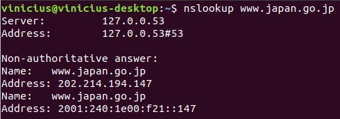

src.html

# Wireshark Lab: DNS

#### Nome:

Vinícius Gonzaga Rocha

#### Matrícula:

11511BCC019

#### Descrição:

Atividade realizada para o aprofundamento do conhecimento do protocolo DNS.

----------

### 1\. nslookup

#### 1\. Run nslookup to obtain the IP address of a Web server in Asia. What is the IP address of that server?

O endereço obtido foi 92.242.140.6 para o site da Universidade de Seoul [www.useoul.edu](http://www.useoul.edu)

#### 2\. Run nslookup to determine the authoritative DNS servers for a university in Europe.

Foi executado para o site da Universidade de Lisboa [www.ulisboa.pt](http://www.ulisboa.pt)

#### 3\. Run nslookup so that one of the DNS servers obtained in Question 2 is queried for the mail servers for Yahoo! mail. What is its IP address?

O IP retornado foi 200.152.162.189. A operação sofreu time out pois o servidor é desconhecido.

----------

### 3\. Tracing DNS with Wireshark

#### 4\. Locate the DNS query and response messages. Are then sent over UDP or TCP?

São enviadas via UDP, conforme imagem.

#### 5\. What is the destination port for the DNS query message? What is the source port of DNS response message?

Destination Port da query: 53  
Source Port da resposta: 53  
Conforme imagens.

  

#### 6\. To what IP address is the DNS query message sent? Use ipconfig to determine the IP address of your local DNS server. Are these two IP addresses the same?

Para o 200.225.197.34. São o mesmo, conforme imagens.

  

#### 7\. Examine the DNS query message. What “Type” of DNS query is it? Does the query message contain any “answers”?

Tipo A (Host Adress) (1). Não possui respostas, conforme imagem.

#### 8\. Examine the DNS response message. How many “answers” are provided? What do each of these answers contain?

Uma resposta foi provida. Contem o IP (Address) 92.242.140.6 além dos campos Name, Type, Class, Time to live, Data length, conforme imagem.

#### 9\. Consider the subsequent TCP SYN packet sent by your host. Does the destination IP address of the SYN packet correspond to any of the IP addresses provided in the DNS response message?

Não. O endereço contido na resposta foi 92.242.140.6 enquanto o destino do pacote SYN foi para 181.114.114.80

#### 10\. This web page contains images. Before retrieving each image, does your host issue new DNS queries?

Não, conforme imagem.

#### 11\. What is the destination port for the DNS query message? What is the source port of DNS response message?

Destination Port da query: 53  
Source Port da resposta: 53  
Conforme imagens.

  

#### 12\. To what IP address is the DNS query message sent? Is this the IP address of your default local DNS server?

Para o 200.225.197.34. São o mesmo, conforme imagens.

  

#### 13\. Examine the DNS query message. What “Type” of DNS query is it? Does the query message contain any “answers”?

Tipo AAA (IPv6 Address) (28). Não possui respostas, conforme imagem.

#### 14\. Examine the DNS response message. How many “answers” are provided? What do each of these answers contain?

Uma resposta foi provida. Contem o IP (Address) 92.242.140.6 além dos campos Name, Type, Class, Time to live, Data length, conforme imagem.

#### 15\. Provide a screenshot.

#### 16. To what IP address is the DNS query message sent? Is this the IP address of your default local DNS server?

Para o 200.225.197.34. São o mesmo, conforme imagens.

#### 17. Examine the DNS query message. What “Type” of DNS query is it? Does the query message contain any “answers”?

É do tipo PTR (domain name PoinTeR) (12), conforme imagem.

#### 18. Examine the DNS response message. What MIT nameservers does the response message provide? Does this response message also provide the IP addresses of the MIT nameservers?

Responde o IP 34.197.225.200, conforme imagem.

#### 19. Provide a screenshot.

#### 20. To what IP address is the DNS query message sent? Is this the IP address of your default local DNS server? If not, what does the IP address correspond to?

A primeira query foi para o mesmo IP local (200.225.197.34) enquanto a segunda foi para o IP (18.72.0.3), conforme imagens.

#### 21. Examine the DNS query message. What “Type” of DNS query is it? Does the query message contain any “answers”?

É do tipo PTR (domain name PoinTeR) (12), conforme imagem.

#### 22. Examine the DNS response message. How many “answers” are provided? What does each of these answers contain?

Uma resposta foi provida, contendo os campos nome do host, tipo, classe, 'time to live', tamanho dos dados e o endereço de IP 18.72.0.3 (bitsy.mit.edu).

#### 23. Provide a screenshot.

